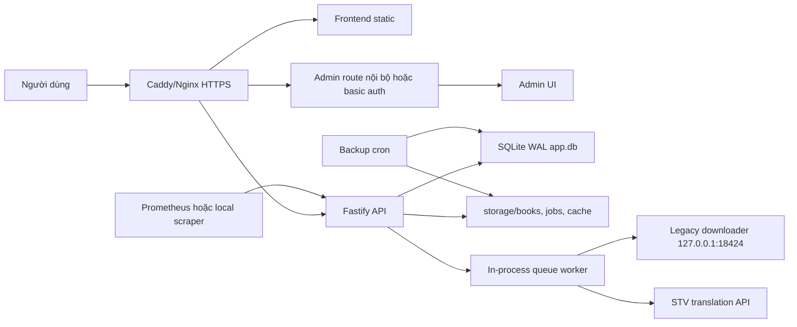
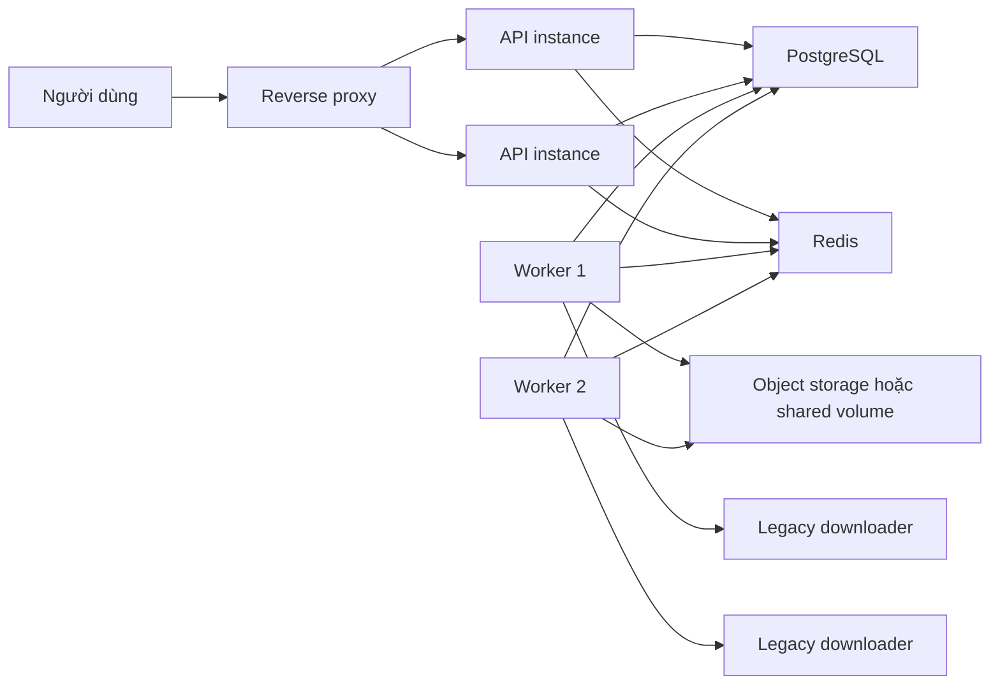

# Kiến trúc mục tiêu

## Mục tiêu

Kiến trúc mục tiêu cần đáp ứng:

- 20-30 người dùng đồng thời xem UI, tìm thư viện, tạo/tải job.
- 1 VPS 2 CPU/4GB RAM/60GB SSD chạy ổn định.
- Tải truyện qua Linux-compatible legacy downloader đã test.
- Có thể restart service mà không mất job đã queue/completed.
- Có thể nâng cấp dần lên nhiều worker hoặc server lớn hơn.

## Kiến trúc production giai đoạn 1

Đây là kiến trúc phù hợp nhất cho VPS hiện tại. Chỉ có một backend process chính, tránh phức tạp distributed lock.

## Thành phần

### Reverse proxy

Nên dùng Caddy nếu muốn TLS tự động, hoặc Nginx nếu đã quen vận hành.

Trách nhiệm:

- Terminate TLS.
- Gzip/brotli static asset.
- Giới hạn body size.
- Rate limit cấp proxy.
- Chỉ proxy route cần thiết tới backend.
- Chặn truy cập trực tiếp `/metrics`, admin port và legacy port từ Internet.

### Backend API

Trách nhiệm:

- Validate input.
- Tạo job.
- Trả trạng thái job.
- Phục vụ file tải về.
- Ghi audit log.
- Expose health/ready/metrics.

Backend không nên:

- Chạy quá nhiều job nặng.
- Tin tưởng `x-forwarded-for` nếu chưa cấu hình trusted proxy.
- Tự public admin không có auth.

### Worker

Giai đoạn 1 worker vẫn nằm trong backend process, nhưng cần quy ước rõ:

- Chỉ một process backend chạy worker.
- `JOB_CONCURRENCY` thấp.
- Khi restart, job `running` được recover về `queued`.
- Không scale ngang API khi worker in-process chưa tách.

Giai đoạn 2 có thể tách worker thành process riêng:

- `api` chỉ nhận request và ghi job.
- `worker` claim job từ DB/Redis.
- Có thể chạy 1-2 worker process tùy CPU/RAM.

### Legacy downloader

Legacy downloader nên chạy loopback-only:

- `LEGACY_HOST=127.0.0.1`.
- `LEGACY_PORT=18424`.
- Không map port ra Internet.
- Binary đặt tại `/opt/tomato-downloader/tools/legacy/TomatoNovelDownloader`.
- Có quyền execute.

Backend là client duy nhất gọi legacy API.

### Database

Giai đoạn 1:

- SQLite WAL.
- Một writer chính.
- Index rõ cho jobs, books, book_files, audit_logs.
- Backup bằng SQLite online backup hoặc checkpoint + copy an toàn.

Giai đoạn 2:

- Nếu user/job tăng mạnh, chuyển PostgreSQL.
- Redis dùng cho rate limit, queue event, distributed lock.

### Storage

Storage local vẫn phù hợp cho VPS hiện tại:

- `storage/books`: file truyện gốc/dịch.
- `storage/jobs`: snapshot job.
- `storage/cache`: cache.
- `storage/legacy`: data riêng của legacy downloader.
- `storage/app.db`: SQLite.

Không nên để `storage` trong image container. Phải mount volume hoặc dùng thư mục host cố định.

## Kiến trúc giai đoạn 2 khi cần scale

Chỉ chuyển sang giai đoạn 2 khi:

- Queue backlog kéo dài dù đã tối ưu.
- SQLite lock/latency xuất hiện thường xuyên.
- Cần nhiều worker hoặc nhiều server.
- Storage 60GB không đủ.

## Quy tắc ranh giới module

- Route không xử lý business logic nặng.
- Service không đọc trực tiếp request/reply.
- Database layer không chứa logic filesystem phức tạp ngoài normalize path.
- Worker không phụ thuộc frontend/admin.
- Legacy bridge phải được bọc sau interface để có thể thay thế.
- Translator phải có rate limit/retry riêng, không để job tạo bão request.

## API cần ổn định hóa

Các API public nên được version sau khi production:

- `/api/v1/books/resolve`
- `/api/v1/jobs/download`
- `/api/v1/jobs/:id`
- `/api/v1/jobs/:id/events`
- `/api/v1/jobs/:id/file`
- `/api/v1/library`
- `/api/v1/library/:bookId/file`

Giữ route cũ một thời gian bằng alias nếu frontend đang dùng.

## Nguyên tắc fail-safe

- Nếu legacy downloader chết, backend phải trả lỗi rõ và job fail có retry.
- Nếu STV lỗi/throttle, job dịch fail có retry/backoff, không retry vô hạn.
- Nếu disk free thấp, không nhận job download mới.
- Nếu DB busy, API phải trả 503/429 thay vì treo.
- Nếu backup fail, admin dashboard phải hiển thị rõ.
