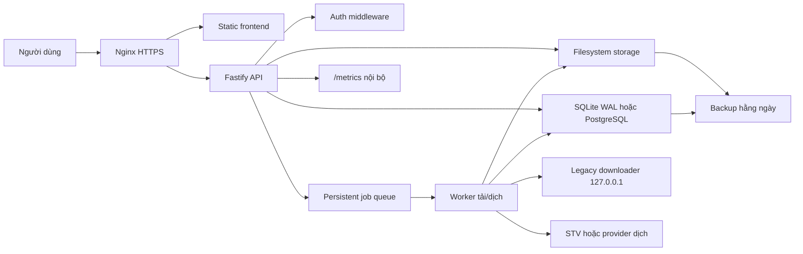

# Kiến trúc production đề xuất

Mục tiêu kiến trúc là giữ hệ thống đơn giản để chạy ổn trên một VPS, nhưng đủ bền để có nhiều user và restart không mất
trạng thái.

## Nguyên tắc

- API web không chạy job nặng trực tiếp trong request.
- Mọi job tải/dịch phải đi qua persistent queue.
- Mọi trạng thái quan trọng phải nằm trong database.
- File truyện nằm trên filesystem, database chỉ lưu metadata, trạng thái, checksum và đường dẫn tương đối.
- Downloader legacy là dependency bên ngoài, phải chạy như sidecar nội bộ, không expose public.
- Production phải có auth, rate limit, quota, backup và metrics ngay từ đầu.

## Sơ đồ mục tiêu



## Kiến trúc một VPS khuyến nghị

Với VPS hiện tại, nên bắt đầu bằng:

- Nginx trên host hoặc container.
- Một container app Node.js.
- SQLite WAL trong volume riêng.
- Filesystem storage trong volume riêng.
- Downloader legacy Linux chạy cùng container hoặc sidecar container.
- Không dùng Redis/PostgreSQL ngay nếu muốn giảm RAM và vận hành đơn giản.

Khi nào nâng cấp:

- Chuyển PostgreSQL khi cần nhiều instance API hoặc truy vấn thư viện phức tạp.
- Thêm Redis/BullMQ khi cần nhiều worker độc lập hoặc retry/schedule nâng cao.
- Tách storage ra object storage khi 60 GB SSD không còn đủ.

## Module backend mục tiêu

Đề xuất refactor dần sang cấu trúc:

```text
apps/backend/src/
├── app.ts
├── server.ts
├── config/
│   ├── env.ts
│   └── logger.ts
├── modules/
│   ├── auth/
│   ├── books/
│   ├── downloads/
│   ├── jobs/
│   ├── library/
│   ├── storage/
│   ├── translation/
│   └── users/
├── infra/
│   ├── db/
│   ├── legacy/
│   ├── queue/
│   └── metrics/
└── shared/
    ├── errors.ts
    ├── schemas.ts
    └── pathSafety.ts
```

Không cần refactor toàn bộ ngay. Khi thêm database và queue, tách theo module mới trước, rồi di chuyển code cũ từng phần.

## API production tối thiểu

API public:

- `POST /api/auth/login`
- `POST /api/auth/logout`
- `GET /api/me`
- `POST /api/books/resolve`
- `GET /api/books`
- `GET /api/books/:bookId`
- `POST /api/jobs/download`
- `POST /api/books/:bookId/translate`
- `GET /api/jobs`
- `GET /api/jobs/:id`
- `GET /api/jobs/:id/events`
- `POST /api/jobs/:id/cancel`
- `POST /api/jobs/:id/retry`
- `GET /api/books/:bookId/files/:kind/:format`

API nội bộ:

- `GET /healthz`: process còn sống.
- `GET /readyz`: DB, storage, legacy bridge sẵn sàng.
- `GET /metrics`: chỉ cho localhost/Nginx allowlist.

## State machine của job

Job nên có state rõ ràng:

```text
queued -> running -> completed
queued -> canceled
running -> canceling -> canceled
running -> failed
failed -> queued
```

Field cần có:

- `id`
- `type`: `download`, `translate`, `artifact`
- `status`
- `bookId`
- `userId`
- `priority`
- `progressCurrent`
- `progressTotal`
- `progressMessage`
- `attemptCount`
- `maxAttempts`
- `lockedBy`
- `lockedAt`
- `createdAt`
- `updatedAt`
- `startedAt`
- `finishedAt`
- `errorCode`
- `errorMessage`

## Luồng tải sách mục tiêu

1. API validate input và auth.
2. Parse `bookId`.
3. Kiểm tra `books` và `book_files`.
4. Nếu sách đã có original hợp lệ, trả về record hiện có.
5. Nếu chưa có, tạo job `download`.
6. Queue đảm bảo cùng một `bookId` chỉ có một download active.
7. Worker gọi legacy downloader.
8. Worker ghi file vào temp path.
9. Worker validate file, tính checksum, move atomic vào storage.
10. Worker cập nhật DB và phát event.

## Luồng dịch mục tiêu

1. API kiểm tra file original tồn tại.
2. Nếu đã có translated file hợp lệ, trả về file hiện có.
3. Nếu chưa có, tạo job `translate`.
4. Worker chia chương, giới hạn concurrency theo config.
5. Mỗi chương dịch xong ghi checkpoint vào DB hoặc temp JSON.
6. Nếu job fail, retry chỉ dịch lại chương chưa xong khi có thể.
7. Khi hoàn tất, ghi TXT/EPUB atomic và cập nhật `book_files`.

## Luồng tạo artifact EPUB

Hiện tại EPUB tạo on demand từ TXT/EPUB nguồn. Production nên tách thành job hoặc cache rõ ràng:

- Nếu file EPUB đã có và checksum hợp lệ, trả ngay.
- Nếu chưa có, tạo job `artifact`.
- Với file nhỏ có thể tạo sync, nhưng cần timeout và lock theo `bookId + kind + format`.

## Ranh giới trách nhiệm

API:

- Auth, validation, tạo job, đọc DB, stream file.
- Không thực hiện tải/dịch dài trong request.

Worker:

- Chạy job nặng.
- Gọi legacy/STV.
- Ghi storage.
- Cập nhật progress.

Database:

- Nguồn sự thật cho user, books, jobs, files, quota, audit.

Filesystem:

- Lưu content thật.
- Không dùng filename làm nguồn metadata duy nhất.

