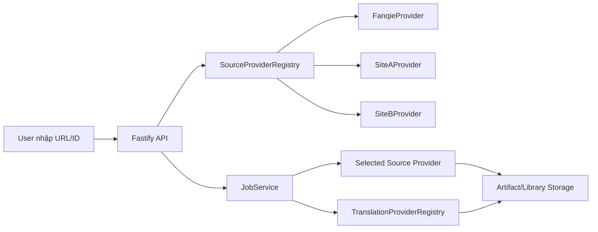

# Kiến trúc adapter/plugin đa nguồn truyện

Tài liệu này thay thế toàn bộ hướng docs cũ. Mục tiêu mới là refactor project hiện tại từ hệ tải truyện xoay quanh Fanqie/Tomato thành kiến trúc adapter/plugin để dễ tích hợp các trang truyện khác, trong khi chức năng người dùng vẫn giữ nguyên:

- Nhập link hoặc ID truyện.
- Hệ thống tự nhận diện nguồn.
- Lấy metadata truyện.
- Tải chương.
- Dịch sang tiếng Việt.
- Lưu vào thư viện.
- Cho tải file TXT/EPUB.
- Theo dõi tiến độ job qua UI.

## Thứ tự đọc

1. [01-goals-and-boundaries.md](./01-goals-and-boundaries.md): mục tiêu, phạm vi và nguyên tắc refactor.
2. [02-core-domain-contracts.md](./02-core-domain-contracts.md): contract dữ liệu lõi dùng chung cho mọi nguồn.
3. [03-source-adapter-architecture.md](./03-source-adapter-architecture.md): kiến trúc adapter/plugin tải truyện.
4. [04-translation-plugin-architecture.md](./04-translation-plugin-architecture.md): kiến trúc plugin dịch.
5. [05-api-ui-job-flow.md](./05-api-ui-job-flow.md): thay đổi API, UI và job flow.
6. [06-provider-implementation-guide.md](./06-provider-implementation-guide.md): hướng dẫn thêm một trang truyện mới.
7. [07-refactor-roadmap.md](./07-refactor-roadmap.md): kế hoạch refactor tuần tự cho AI/dev.

## Hướng refactor chính

Hiện tại backend có các service gắn với Fanqie:

- `FanqieService`: tải trực tiếp bằng API/HTML Fanqie.
- `LegacyService`: bridge sang downloader gốc Tomato.
- `JobService`: điều phối job nhưng vẫn gọi trực tiếp Fanqie/legacy.

Sau refactor, `JobService` không biết site cụ thể. Nó chỉ làm việc với:

- `SourceProviderRegistry`: nhận diện và chọn provider.
- `ISourceProvider`: contract tải truyện cho từng nguồn.
- `ITranslationProvider`: contract dịch nội dung.
- `ArtifactService`: lưu file theo format chung.

## Kiến trúc mục tiêu ngắn gọn

## Nguyên tắc

- Core không chứa logic riêng của từng site.
- Mỗi site là một provider độc lập.
- Mọi provider trả về cùng một kiểu dữ liệu chuẩn.
- Translation tách khỏi source download.
- UI chỉ hiển thị source metadata, không hard-code Fanqie.
- Có thể thêm provider mới mà không sửa `JobService` theo từng site.
