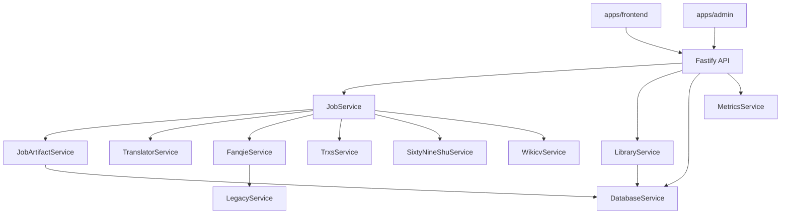

# Kiến Trúc Backend

Backend nằm ở `apps/backend` và là trung tâm của toàn bộ hệ thống. Nó nhận request từ frontend, điều phối job,
ghi dữ liệu vào SQLite, phục vụ file tải xuống, và cung cấp số liệu cho admin dashboard.

## Mục Tiêu Thiết Kế

- Một backend duy nhất điều phối toàn bộ nghiệp vụ.
- Tách rõ lớp HTTP, service, storage, và utilities.
- Hỗ trợ cả luồng hiện đại lẫn cầu nối legacy cho Fanqie.
- Giữ trạng thái job và thư viện trên local disk để dễ deploy bằng Docker hoặc máy cá nhân.

## Điểm Vào Chính

- `apps/backend/src/server.ts`
- `apps/backend/src/routes/apiRoutes.ts`
- `apps/backend/src/config.ts`
- `apps/backend/src/infra/db/database.ts`

## Thành Phần Cốt Lõi

### 1. HTTP Server

`server.ts` tạo Fastify app, đăng ký CORS, mount route, phục vụ static frontend build, và mở admin server riêng
nếu có `apps/admin/dist`.

Ngoài API chính, backend còn cung cấp:

- `/healthz`
- `/readyz`
- `/metrics`

### 2. Cấu Hình

`config.ts` đọc biến môi trường và tạo `AppConfig`.

Các nhóm cấu hình chính:

- cổng và host
- thư mục dữ liệu
- quota và concurrency
- translation provider
- legacy bridge
- STV endpoint và key

### 3. Cơ Sở Dữ Liệu

`DatabaseService` dùng SQLite và tạo các bảng:

- `books`
- `book_files`
- `jobs`
- `job_events`
- `audit_logs`
- `download_locks`

Nó cũng:

- recover job đang `running` khi khởi động lại
- claim job `queued` theo thứ tự ưu tiên
- upsert thư viện và file artifact
- thống kê job và storage

### 4. Điều Phối Job

`JobService` là lớp điều phối trung tâm. Nó:

- tạo job tải
- tạo job dịch
- xử lý retry / cancel
- phát event tiến trình qua SSE
- lưu snapshot job vào `storage/jobs`
- đồng bộ dữ liệu sang DB

### 5. Quản Lý Artifact

`JobArtifactService` xử lý:

- ghi TXT / EPUB
- sinh lại format thiếu khi tải xuống
- đọc chapter từ TXT / EPUB
- cập nhật metadata thư viện

### 6. Nguồn Truyện

`sourceCatalog.ts` khai báo danh sách nguồn:

- Fanqie
- Qidian
- 69shu
- trxs.cc
- Wikicv

Mỗi nguồn có:

- `id`
- `displayName`
- `inputHint`
- `supportsTranslate`
- `requiresAuth`

## Luồng Yêu Cầu

### Resolve

1. User nhập link hoặc ID.
2. Frontend gọi `POST /api/books/resolve`.
3. Backend xác định nguồn.
4. Service của nguồn lấy book info và chapter list.
5. Backend trả về `DownloadPlan`.

### Download

1. Frontend gọi `POST /api/jobs/download`.
2. Backend tạo job `queued`.
3. Worker queue claim job.
4. `JobService` tải chapter theo nguồn.
5. `JobArtifactService` ghi file và cập nhật thư viện.
6. Job chuyển sang `completed` hoặc `failed`.

### Translate

1. Frontend gọi `POST /api/jobs/:id/translate` hoặc `POST /api/library/:bookId/translate`.
2. Backend tạo job dịch từ job nguồn hoặc từ file trong thư viện.
3. `TranslatorService` xử lý theo provider.
4. `JobArtifactService` ghi bản dịch vào `storage/books`.

## Cầu Nối Legacy

Backend mới có thể dùng exe legacy gốc khi:

- `LEGACY_BRIDGE=true`
- file exe tồn tại tại đường dẫn cấu hình

Khi bật bridge, backend có thể:

- resolve Fanqie bằng luồng cũ
- proxy preview cover
- warm up legacy backend khi ready check

## Cổng Quản Trị

`GET /api/admin/overview` chỉ cho phép request đi qua admin portal nội bộ.
Nó trả về:

- counts: books, files, jobs, audit logs
- operations: queue depth, running depth, error window
- storage: dung lượng đĩa và app data
- quotas: snapshot quota
- backup: trạng thái backup gần nhất

## Quan Sát Hệ Thống

Backend có các cơ chế quan sát sau:

- log request id qua header `x-request-id`
- đo latency request
- export Prometheus text ở `/metrics`
- ghi audit log cho action quan trọng

## Các Lớp Chính Và Trách Nhiệm

| Lớp | Trách nhiệm |
| --- | --- |
| `server.ts` | Khởi động app, mount route, static files, admin server |
| `apiRoutes.ts` | Định nghĩa HTTP API |
| `JobService` | Điều phối job và queue |
| `JobArtifactService` | File output, convert format, metadata artifact |
| `DatabaseService` | SQLite persistence và query |
| `LibraryService` | Truy xuất thư viện |
| `TranslatorService` | Dịch nội dung |
| `FanqieService` / `TrxsService` / `SixtyNineShuService` / `WikicvService` | Tải dữ liệu theo nguồn |

## Sơ Đồ Mermaid

## Ghi Nhớ Khi Sửa Backend

- Không gọi `Find()` / `GetComponent()` kiểu Unity, nhưng vẫn phải cache reference và tránh tạo allocation thừa trong
  vòng lặp nóng.
- Giữ các biến môi trường tương thích với luồng deploy hiện tại.
- Nếu đổi format file hoặc đường dẫn, phải cập nhật cả DB mapping và artifact service.
- Nếu thêm route mới, nên kèm audit log hoặc rate limit nếu route có thể bị spam.
