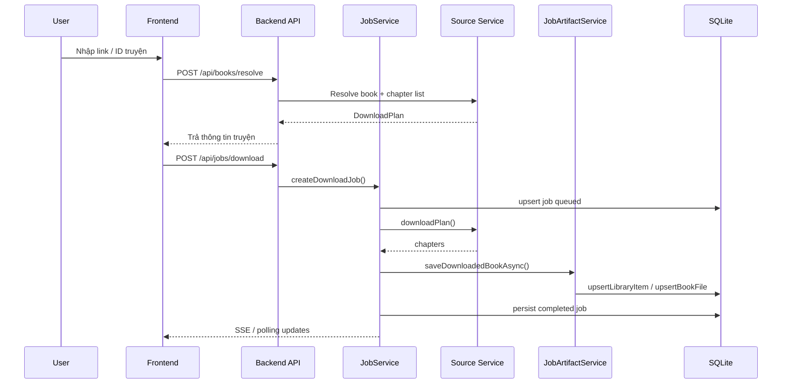
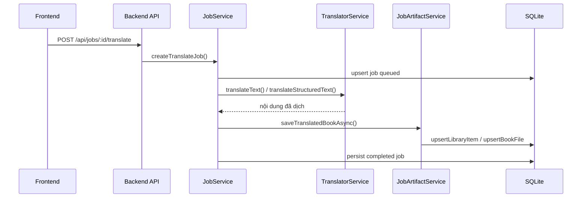

# Luồng Job Tải Và Dịch

Tài liệu này mô tả vòng đời job trong hệ thống, từ lúc người dùng nhập truyện cho tới lúc file được lưu và
hiển thị trong thư viện.

## Trạng Thái Job

`JobRecord.status` có các giá trị:

- `queued`
- `running`
- `completed`
- `failed`
- `canceled`

## Phân Loại Job

### Job tải

Job tải truyện gốc từ nguồn.

### Job dịch

Job dịch nội dung đã tải sẵn hoặc lấy từ thư viện.

## Luồng Tải

### Các Bước Chi Tiết

1. Frontend gọi `resolveBook()` để lấy `DownloadPlan`.
2. Nếu người dùng bấm tải, frontend gọi `startDownload()`.
3. Backend tạo job và ghi vào DB.
4. Queue worker claim job theo `jobConcurrency`.
5. `JobService` chọn service theo nguồn:
   - `FanqieService`
   - `SixtyNineShuService`
   - `TrxsService`
   - `WikicvService`
   - `LegacyService` nếu Fanqie bridge đang bật
6. Chapter được chuẩn hóa thành `StoredChapter[]`.
7. `JobArtifactService` ghi TXT hoặc EPUB và tạo metadata chapters.
8. Thư viện được upsert để UI đọc lại ngay.

## Luồng Dịch

### Dịch Từ Job Gốc

Nếu job nguồn đã hoàn tất và có file tiếng Trung:

- lấy `originalTxt` hoặc `originalEpub`
- load chapter từ file
- dịch theo batch
- ghi `translated.txt`

### Dịch Từ Thư Viện

Nếu dịch từ `POST /api/library/:bookId/translate`:

- tìm item trong DB
- lấy `originalPath`
- tạo job dịch kiểu library
- ghi bản dịch vào cùng thư mục sách

## Thử Lại Và Hủy

### Hủy

Khi cancel:

- job được đánh dấu `canceled`
- progress đổi sang thông điệp đã hủy
- worker đang chạy sẽ bị chặn ở các điểm `throwIfCancelled()`

### Thử Lại

Retry chỉ hợp lệ với job `failed` hoặc `canceled`.

- download job sẽ được tạo lại từ input cũ
- translate job từ library sẽ dùng lại file trong thư viện
- translate job từ job nguồn sẽ quay lại job nguồn ban đầu

## Phát Tiến Độ

Backend dùng hai kênh cập nhật:

- SSE ở `GET /api/jobs/:id/events`
- polling fallback nếu `EventSource` không hỗ trợ

Mỗi update gồm:

- `current`
- `total`
- `percent`
- `message`

## Lưu Trữ Khi Job Hoàn Tất

### Tải hoàn tất

Thư mục job thường có:

- file TXT hoặc EPUB gốc
- `chapters.json`
- metadata DB tương ứng

### Dịch hoàn tất

Thư mục sách thường có:

- `original.txt` hoặc `original.epub`
- `translated.txt`
- `chapters.json`
- file EPUB nếu có build lại format

## Hạn Mức Và Rate Limit

Job creation bị ảnh hưởng bởi:

- `DAILY_JOB_QUOTA`
- `JOB_CONCURRENCY`
- rate limit theo route trong `apiRoutes.ts`

Mục tiêu là:

- tránh spam request
- không cho một user chiếm toàn bộ queue
- giảm rủi ro quá tải khi dịch hàng loạt

## Các Điểm Dễ Hỏng

- chapter list không lấy được từ nguồn
- endpoint Fanqie bị chặn hoặc throttle
- file gốc không tồn tại khi retry dịch
- DB không ghi được snapshot job
- output format chưa có nên phải sinh lại artifact

## Khi Gỡ Lỗi Job

Ưu tiên kiểm tra theo thứ tự:

1. job status trong DB và file `storage/jobs/<id>.json`
2. event stream `/api/jobs/:id/events`
3. log backend
4. file artifact trong `storage/books`
5. cache chapter trong `storage/cache/directory`
