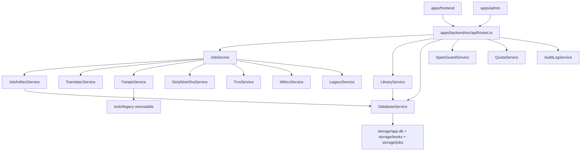

# Sơ Đồ Module Và Phụ Thuộc

Tài liệu này ghi lại các phụ thuộc chính trong repo để hỗ trợ sửa code, refactor, và đọc kiến trúc nhanh.

## Cấp Module Cao

Repo chia thành các nhóm sau:

- `apps/backend`: xử lý nghiệp vụ và lưu trữ
- `apps/frontend`: UI người dùng
- `apps/admin`: UI quản trị
- `scripts`: thao tác vận hành
- `tests`: kiểm thử
- `tools/legacy`: binary legacy

## Phụ Thuộc Chính

## Phân Lớp

### 1. Lớp Trình Bày

- `apps/frontend`
- `apps/admin`

Chỉ gọi API backend, không truy cập trực tiếp vào storage.

### 2. Lớp Ứng Dụng

- `JobService`
- `LibraryService`
- `TranslatorService`
- `AuditLogService`
- `QuotaService`
- `SpamGuardService`

Đây là lớp điều phối và chính sách.

### 3. Lớp Miền / Bộ Chuyển Nguồn

- `FanqieService`
- `SixtyNineShuService`
- `TrxsService`
- `WikicvService`
- `LegacyService`

Mỗi service chịu trách nhiệm parse, resolve, và download theo nguồn.

### 4. Lớp Lưu Trữ / Hạ Tầng

- `DatabaseService`
- `MetricsService`
- `storageSummary`
- `pathSafety`

### 5. Tiện Ích

- `utils/text.ts`
- `utils/file.ts`
- `utils/epub.ts`
- `utils/chapterParsing.ts`
- `utils/jobProgress.ts`

## Những Phụ Thuộc Nên Giữ Ổn Định

### `JobService`

Đây là nút trung tâm. Nhiều thay đổi ở đây sẽ ảnh hưởng tới:

- route API
- artifact service
- thư viện
- retry / cancel logic
- DB persistence

### `DatabaseService`

Nên giữ schema và mapping ổn định vì:

- nó phục vụ dashboard admin
- nó phục vụ recovery job
- nó lưu thư viện và artifact metadata

### `JobArtifactService`

Đây là lớp dễ tạo regression nhất nếu đổi tên file hoặc đổi format. Nó liên quan trực tiếp tới:

- download file
- build EPUB
- sinh lại format còn thiếu
- metadata thư viện

## File Dễ Gây Tác Động Dây Chuyền

| File | Lý do |
| --- | --- |
| `apps/backend/src/services/jobService.ts` | Điều phối job, queue, retry, cancel |
| `apps/backend/src/infra/db/database.ts` | Schema và query của toàn hệ thống |
| `apps/backend/src/services/jobArtifactService.ts` | File artifact và đồng bộ thư viện |
| `apps/backend/src/routes/apiRoutes.ts` | Hợp đồng HTTP với frontend |
| `apps/frontend/src/api.ts` | Hợp đồng API phía client |
| `apps/frontend/src/App.tsx` | Luồng UI chính |
| `apps/backend/src/server.ts` | Bootstrap và static serving |

## Cụm Chức Năng

### Cụm Tải

- `resolveBook()`
- `createDownloadJob()`
- `downloadPlanAsync()`
- `saveDownloadedBookAsync()`

### Cụm Dịch

- `createTranslateJob()`
- `createTranslateJobFromLibrary()`
- `runTranslateJob()`
- `translateStructuredText()`

### Cụm Legacy

- `LegacyService`
- `LegacyOutputLocatorService`
- `proxyLegacyImage()`
- `warmLegacyAsync()`

### Cụm Thư Viện

- `LibraryService`
- `DatabaseService.listLibraryItems()`
- `DatabaseService.findLibraryItem()`

## Kết Nối Test

Test hiện tại tập trung vào:

- source adapters
- parsing
- metrics
- path safety
- job progress
- spam guard

Điều này cho thấy các lớp có rủi ro cao nhất hiện nằm ở:

- `JobService`
- `DatabaseService`
- `JobArtifactService`
- các service nguồn truyện

## Gợi Ý Khi Refactor

1. Nếu đổi API route, cập nhật `apps/frontend/src/api.ts` trước.
2. Nếu đổi storage schema, cập nhật `DatabaseService` và các test liên quan.
3. Nếu đổi artifact layout, cập nhật cả `JobArtifactService` và `LibraryService`.
4. Nếu đổi source adapter, kiểm tra lại flow `resolve -> download -> translate`.
5. Nếu thêm module mới, ưu tiên đặt nó ở đúng lớp thay vì trộn logic vào route.
